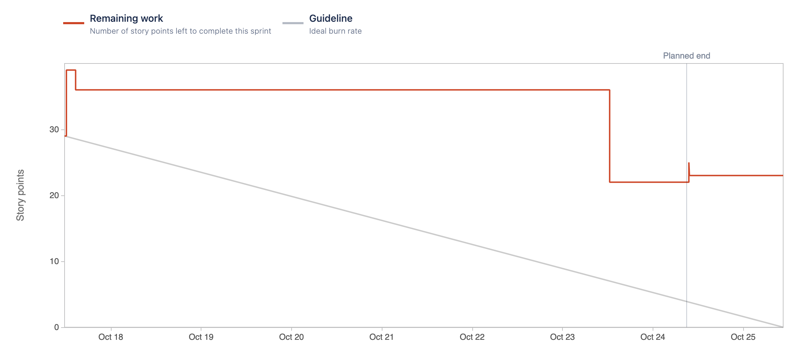

# Sprint 3

### Sprint Date
17 October 2022 to 24 October 2022

### Sprint Goal
As our main goal for this sprint, we want to have the Email Notifications User Story done. For this we'll have to finish the UI for this feature, create the database and connect it to the API. We'll also implement tests and document our features.

### Sprint User-Stories
#### Completed User-Stories
* [[ECP-46] As an admin I want my system to send a email notification on a break in](https://es-project.atlassian.net/browse/ECP-46)
    * [ECP-20] Create Send Notifications Endpoint
    * [ECP-21] Store and Access Client Preferences
    * [ECP-22] Send Email Notifications

#### Not Complete User-Stories that passed to the next Sprint
* [[ECP-8] As a client i want to choose to receive notifications  via email so that i can quickly get feedback on a break-in](https://es-project.atlassian.net/browse/ECP-8)

#### Not Complete Tasks that passed to the next Sprint
* [[ECP-45] Creation of a central database that allows the insertion of Companies, Managers, Buildings and Devices which can be accessed by other services.](https://es-project.atlassian.net/browse/ECP-45)

### Burndown Chart

