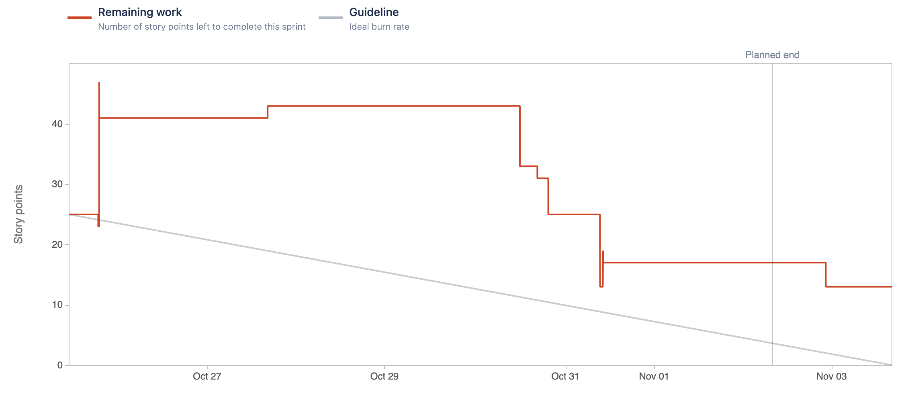

# Sprint 4

### Sprint Date
25 October 2022 - 2 November 2022

### Sprint Goal
Our main goal will be connect the management site to the backend-api, and deploy the HDM.

### Sprint User-Stories
#### Completed User-Stories
* [[ECP-6] As a manager, I want to have access to a management system so that I can register new cameras.](https://es-project.atlassian.net/browse/ECP-6)
    * [ECP-56] Design Web Page Structure
    * [ECP-57] Create New Cameras Frontend
    * [ECP-62] Connect Cameras Frontend to API
* [[ECP-52] As a manager, I want to be able to register new buildings on the platform.](https://es-project.atlassian.net/browse/ECP-52)
    * [ECP-55] Design Web Page Structure
    * [ECP-58] Create Buildings Frontend
    * [ECP-61] Connect Buildings Frontend to API
* [[ECP-53] As a manager, I want to be able to register new companies on the platform.](https://es-project.atlassian.net/browse/ECP-53)
    * [ECP-54] Design Web Page Structure
    * [ECP-59] Create Companies Frontend
    * [ECP-60] Connect Companies Frontend to API
* [[ECP-65] As a manager, I want to be able to remove devices from buildings.](https://es-project.atlassian.net/browse/ECP-65)
    * [ECP-66] Design Web Page Structure
    * [ECP-67] Create Remove Devices Frontend
    * [ECP-68] Connect Frontend to API

#### Completed Tasks
* [[ECP-45] Creation of a central database that allows the insertion of Companies, Managers, Buildings and Devices which can be accessed by other services.](https://es-project.atlassian.net/browse/ECP-45)
* [[ECP-63] Push Images to AWS ERC](https://es-project.atlassian.net/browse/ECP-63)

#### Not Complete User-Stories that passed to the next Sprint
* [[ECP-8] As a client i want to choose to receive notifications  via email so that i can quickly get feedback on a break-in](https://es-project.atlassian.net/browse/ECP-8)

#### Not Complete Tasks that passed to the next Sprint
* [[ECP-25] Create API Gateway for all the API’s communication.](https://es-project.atlassian.net/browse/ECP-25)

### Burndown Chart

