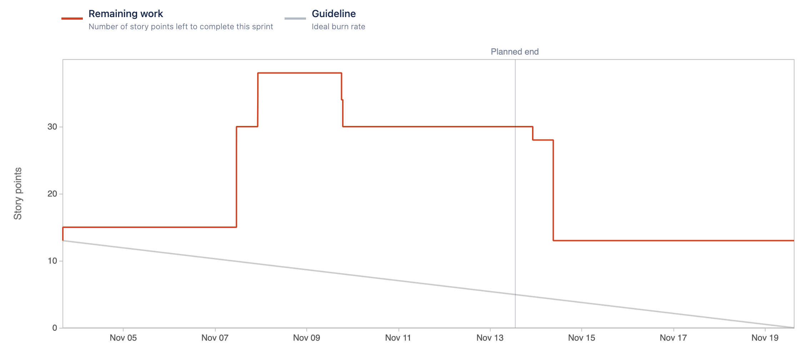

# Sprint 5

### Sprint Date
3 November 2022 - 13 November 2022

### Sprint Goal
The main goal of this sprint is to start the migration of the camera and HDM modules to AWS. Also work on the configuration of the VPC and subnets as well as start working on IDP for the project.

### Sprint User-Stories
#### Completed User-Stories
* [[ECP-26] Create In-Memory Database with Redis for the Human Detection Module.](https://es-project.atlassian.net/browse/ECP-26)
    * [ECP-39] Create Redis Docker Container
    * [ECP-40] Connect HDM Module to Redis
    * [ECP-41] Implement HDM Module Business Logic
    * [ECP-72] Deploy to AWS
* [[ECP-16] As a client and manager, I want to be able to authenticate on my account so that I can have access to my information.](https://es-project.atlassian.net/browse/ECP-16)
    * [ECP-80] Create Frontend IDP Trigger
    * [ECP-81] Develop IDP Logic
* [[ECP-74] As a Manager I want to be able to edit companies details.](https://es-project.atlassian.net/browse/ECP-74)
    * [ECP-76] Create Company Frontend
    * [ECP-77] Connect Edit Company Frontend
* [[ECP-75] As a Manager I want to be able to edit Building details.](https://es-project.atlassian.net/browse/ECP-75)
    * [ECP-78] Create Building Frontend to Edit Details
    * [ECP-79] Connect Edit Building Frontend

#### Completed Tasks
* [[ECP-69] Set up VPC and Subnets needed for services in AWS.](https://es-project.atlassian.net/browse/ECP-69)
* [[ECP-71] HDM to AWS](https://es-project.atlassian.net/browse/ECP-71)

#### Not Complete User-Stories that passed to the next Spring
* [[ECP-8] As a client i want to choose to receive notifications  via email so that i can quickly get feedback on a break-in](https://es-project.atlassian.net/browse/ECP-8)

#### Not Complete Tasks that passed to the next Spring
* [[ECP-25] Create API Gateway for all the API’s communication.](https://es-project.atlassian.net/browse/ECP-25)
* [[ECP-82] Create Production Docker Images](https://es-project.atlassian.net/browse/ECP-82)

### Burndown Chart

