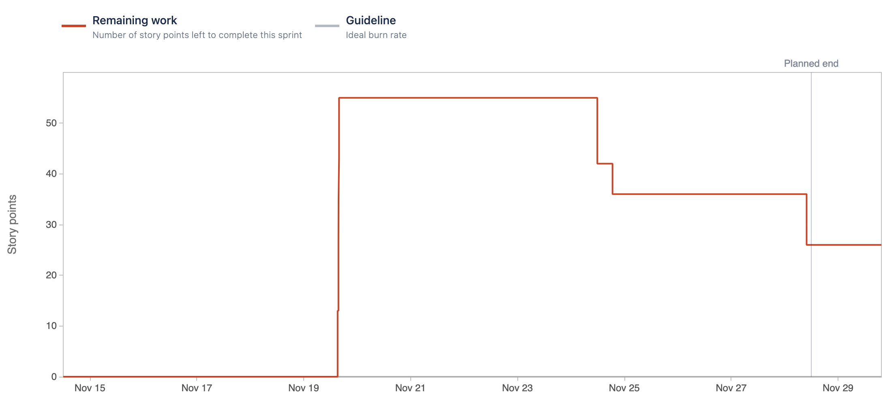

# Sprint 6

### Sprint Date
14 November 2022 - 28 November 2022

### Sprint Goal
The main goal of this sprint is to complete the core problem of the project. Save the intrusion video, trigger events as well as check events that were triggered. Also, we want to achieve the point were information is filtered per user, based on IDP informations.

### Sprint User-Stories
#### Completed User-Stories
* [[ECP-51] As a client, I want to have intrusion detected and stored.](https://es-project.atlassian.net/browse/ECP-51)
    * [ECP-85] Store videos of intrusions into S3 bucket
    * [ECP-86] Notify the Intrusion API of new intruders
    * [ECP-92] Create S3 Video Store
    * [ECP-93] Send video from camera to intrusion API

#### Completed Tasks
* [[ECP-25] Create API Gateway for all the API’s communication.](https://es-project.atlassian.net/browse/ECP-25)
* [[ECP-89] Create Functional Tests using Selenium and Webdriver](https://es-project.atlassian.net/browse/ECP-89)
* [[ECP-94] Update Documentation](https://es-project.atlassian.net/browse/ECP-94)

#### Not Complete User-Stories that passed to the next Sprint
* [[ECP-24] As a client, I want to have access to a management system so that I can check all events that were triggered in my building.](https://es-project.atlassian.net/browse/ECP-24)
* [[ECP-84] As a client, I want to be able to see my buildings, so then I can watch my cameras and alarms.](https://es-project.atlassian.net/browse/ECP-84)
* [[ECP-19] As a client, I want to have access to a management system so that I can obtain data from cameras.](https://es-project.atlassian.net/browse/ECP-19)

#### Not Complete Tasks that passed to the next Sprint
* [[ECP-82] Create Production Docker Images](https://es-project.atlassian.net/browse/ECP-82)

### Burndown Chart

